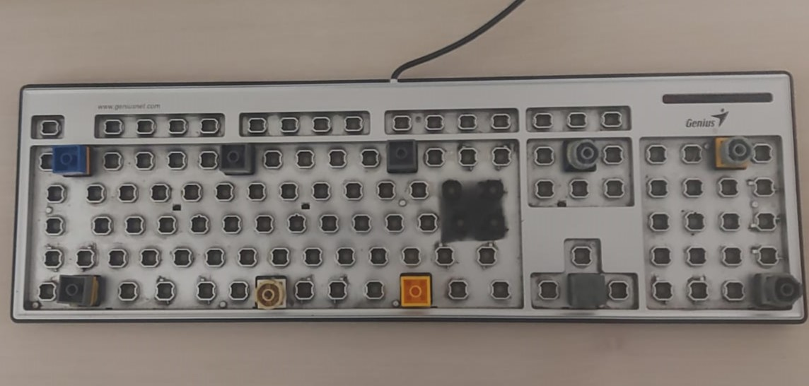

# 🎸 MIDI-Keyboard-Foot-Controller

**MIDI-Keyboard-Foot-Controller** turns a **second keyboard** into a MIDI foot pedalboard. By using **AutoHotkey** and **AutoHotInterception (AHI)**, it converts physical key presses from a specific device into **MIDI CC messages** without interfering with your main typing keyboard.

## 🧠 How it works

The script intercepts raw input from secondary keyboards and converts them into **MIDI CC commands** organized into 3 "Groups" or "Modes."

* **Pure MIDI:** It communicates via virtual MIDI ports.
* **Universal Compatibility:** Works with **AmpliTube, Neural DSP, Guitar Rig, REAPER, Ableton, Logic**, and any other software that accepts MIDI CC.
* **Background Operation:** Works even when your DAW or Plugin is minimized or not in focus.
* **Visual HUD:** A minimalist 4K-ready On-Screen Display (OSD) shows the active Mode (1, 2, or 3) whenever you switch.

---

## 🔌 Dependencies

* **[AutoHotkey (v1.1)](https://www.autohotkey.com/)** -> The scripting engine.
* **[AutoHotInterception](https://github.com/evilC/AutoHotInterception)** -> Library included in `Lib/` to isolate the second keyboard.
* **[loopMIDI](https://www.tobias-erichsen.de/software/loopmidi.html)** -> Required to create the virtual MIDI cable.

---

## ⌨️ Hardware Layout

**Recommendations:**

* **10 keys total** 
* Keys should be **well spaced** so you can hit them blindly with your foot
* If the keys are too short glue **LEGO bricks** or similar plastic blocks on top to increase height and tactile feedback

---

## 📁 Repository Structure

* **`MidiFootController.ahk`**: The main script. Handles the MIDI logic.
* **`Monitor.ahk`**: Utility to identify your secondary keyboard's **DeviceID** and find **ScanCodes**.
* **`Lib/`**: Contains the AHI framework (Required).

---

## ⚙️ Setup Instructions

### 1. LoopMIDI Setup

1. Open loopMIDI.
2. Create a new port named: `LoopMIDI Port`.
3. Keep loopMIDI running in the background.

### 2. Identify your Keyboard & Keys

Before running the main script, you must identify your specific hardware IDs using **`Monitor.ahk`**.

#### **Identifying the Device ID**

* **The Highest ID Rule:** In most setups, the last keyboard plugged in will be assigned the **highest DeviceID**.
* **The ID Limit:** Windows/AHI supports a maximum of **10 Keyboard IDs**.
* **When unpluged and repluged:** If you unplug and replug your keyboard, Windows wukk increments the ID (e.g., from ID 7 to ID 8).
* These IDs **only reset** after a full system restart.

* **Subscription Logic:** To ensure the script works even if the keyboard "moves" IDs after being replugged, the script is configured to subscribe to **ID 6 and everything above it** (up to 10). This creates a "safety net" so you don't have to edit the script every time you move a USB cable.
* you may need to modify the line 24: `Loop, 5 {`. My keyboard ID is 6 so for me the number is 6 - 1 = 5.

#### **Identifying ScanCodes**

1. Run `Monitor.ahk`.
2. Press the keys you intend to use as pedals.
3. Note the **ScanCode** for each key (e.g., `57` for Space, `347` for Right-Alt).
4. If your keys differ from the defaults in the script, update the `Codes := [...]` array at the top of the `MidiFootController.ahk` file.

---

### 3. Usage & Modes

* **The Keys:** 10 physical keys are mapped to CC messages.
* **The Switch:** Press **F1** on the secondary keyboard to cycle through **Modes 1, 2, and 3**.
* **The CC Mapping:**

| Key | Mode 1 (CC) | Mode 2 (CC) | Mode 3 (CC) |
| --- | --- | --- | --- |
| **Pedal 1** | 90 | 100 | 110 |
| **Pedal 2** | 91 | 101 | 111 |
| ... | ... | ... | ... |
| **Pedal 10** | 99 | 109 | 119 |
